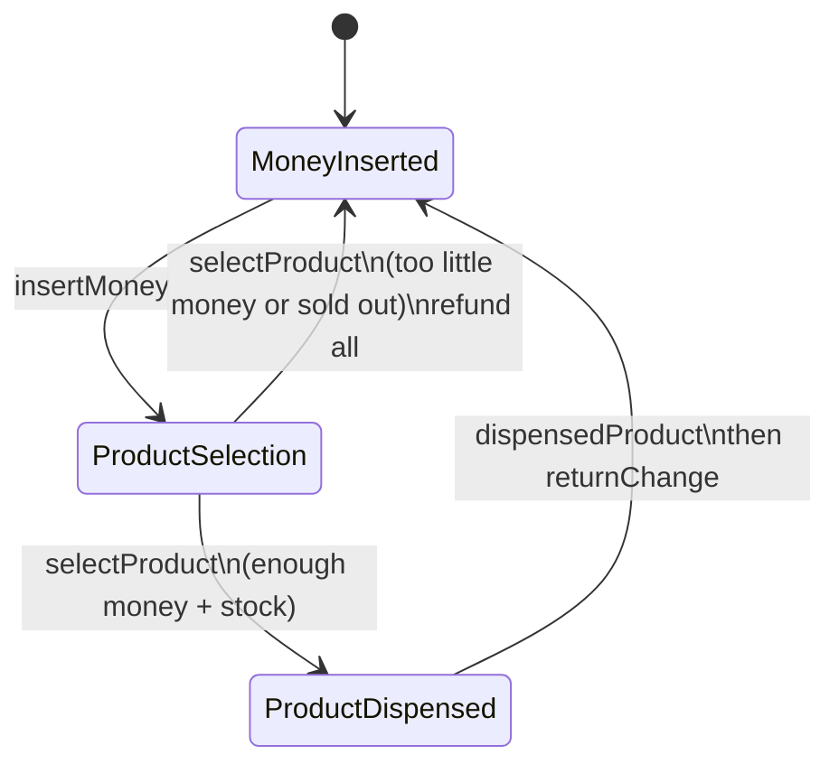
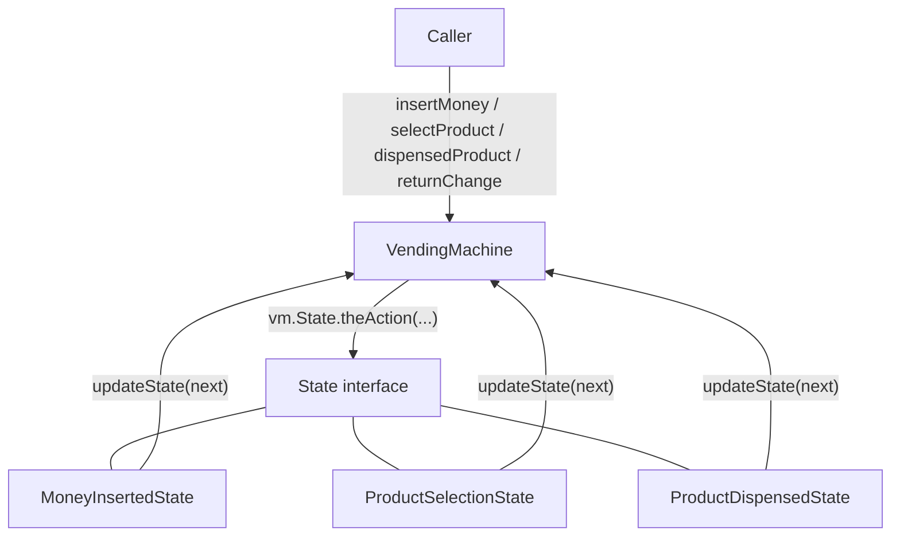

# Vending Machine (Go)

A small vending machine in Go using the **state design pattern**.

## What it does

- Add and remove products in **inventory**
- Insert money into the vending machine
- Select a product
- Dispense the product and return change

## Types

| Type | Role |
|------|------|
| `Product` | Id, name, quantity, cost |
| `Inventory` | Map of products by id |
| `VendingMachine` | Holds inventory, money, selected product, and current state |
| `State` (interface) | Actions the machine can receive |

### States

- **MoneyInsertedState** — accept cash, then move to selection
- **ProductSelectionState** — pick a product if there is enough money and stock
- **ProductDispensedState** — vend the item and return change

## Flow (quick revision)

Starts in **MoneyInsertedState**.



Happy path: insert money → select product → dispense → change → back to insert money.

`VendingMachine` does not `switch` on “which step we are in.” It **delegates** to the current `State`:

```go
func (vm *VendingMachine) insertMoney(amount int) {
    vm.State.insertMoney(amount)
}
```

Each state implements the same methods. Valid actions do the work and call `updateState(...)`. Invalid actions print a message (e.g. select product before inserting money).

## Mental model (state pattern)

Caller never talks to a concrete state. The machine holds **one** `State` and forwards every action. The current state may swap itself out via `updateState`.



Only one of M / P / D is current at a time. Same call from `main`, different struct runs.

## Why the state pattern helps here

A vending machine is a **sequence of modes**. The same button means different things depending on the mode:

| Action | Money inserted | Product selection | Dispensed |
|--------|----------------|-------------------|-----------|
| Insert money | Add cash, go to selection | “Already inserted” | “Wait until dispensed” |
| Select product | “Insert money first” | Check price & stock | “Already selected” |
| Dispense | Not allowed yet | “Select first” | Reduce stock, return change |

Without states, `insertMoney` / `selectProduct` would fill up with `if current == ...` branches. Every new step (out of stock, refund only, maintenance) would touch those functions again.

With states:

- Each mode is its **own type** with its own rules
- The machine stays **open for new states** (new struct + interface methods) without rewriting a giant switch
- Illegal operations stay in the **wrong** state as no-ops or messages, so you cannot dispense before paying

That is the point of the pattern: **behavior changes with internal state**, without the caller knowing which struct is current.

`main.go` runs a few scenarios: enough money, too little money, exact amount, and empty stock.
